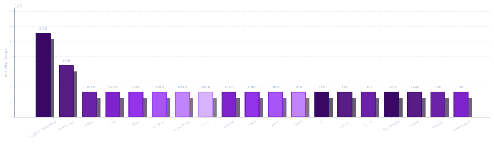

  
  
  
  
  

---

  

   
  
     
    
    
  
    

    

  

  

    
  
    
      
     

   
   
   
   
   
      
   
   
   

   

  
      
   

   
   
   
   
   
   
     
 
   
     
    

      

    
    
   
   
     
      
  
  
   

 

---

#### ✦ Some Certifications & Achievements

✧ 📜 Certificate, Opportunity Open Source Conference 
✧ 📜 Hackathon, IBM Dev Day 
✧ 📜 Hackathon, GDGoC Dev-Sprint 
✧ 📜 Examination, MongoDB Associate Data Modeler 
✧ 📜 Examination, Microsoft GitHub Foundations 
✧ 📜 Course, Stanford University Code in Place

---

#### ✦ GitHub Statictics

|  |  |  |
|:--|:--|:--|
|  |   |  |
|  |  |  |
|  |   |  |
|  |  |  |
|  |   |  |
|  |  |  |
---

<table>
  <tr>
    <td width="40%" align="center">
  
      </td>
    <td width="60%" align="center">
  
    </td>
  </tr>
</table>

